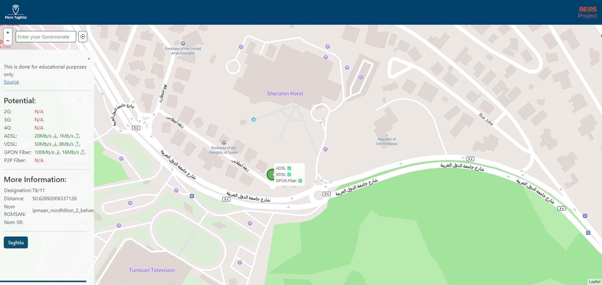
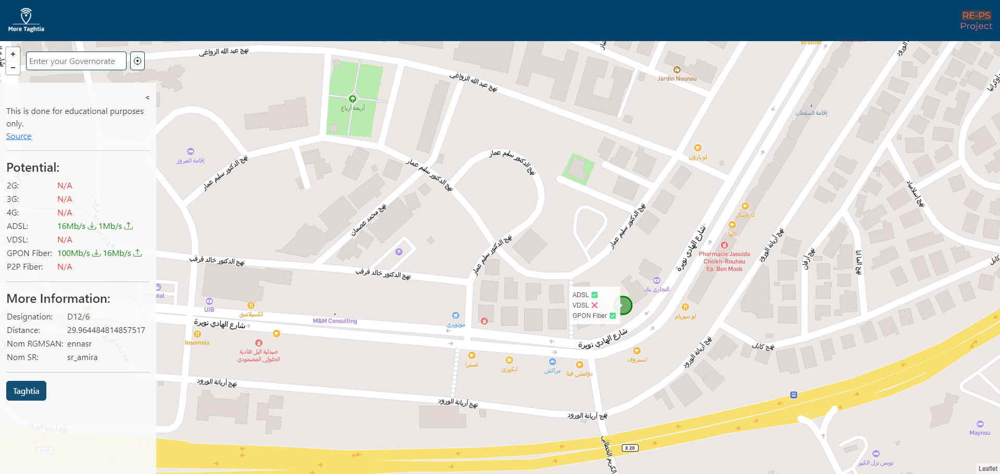

#

## Description

More Taghtia is an improved version of [Taghtia](https://geo.tunisietelecom.tn/mytaghtia/), a web application that allows you to check the coverage of Tunisie Telecom in your area.

## How to use

1. Enter your governorate in the search bar.
2. Click on the "Check Coverage" button.
3. The map will display the coverage of Tunisie Telecom in your area.

## How it works

The application uses the Tunisie Telecom API to get the coverage data. The API is not public, so I had to reverse engineer it. The API is called when you click on the "Check Coverage" button. The API returns a JSON file containing the coverage data. The application then parses the JSON file and displays the coverage on the map.

## How to install

1. Clone the repository.
2. Open index.html in your browser.
3. Enjoy!

## Screenshots

## Contributing

Pull requests are welcome. For major changes, please open an issue first to discuss what you would like to change.

Please make sure to update tests as appropriate.

## Disclaimer

This is done for educational purposes only.

## License

Apache-2.0 license
